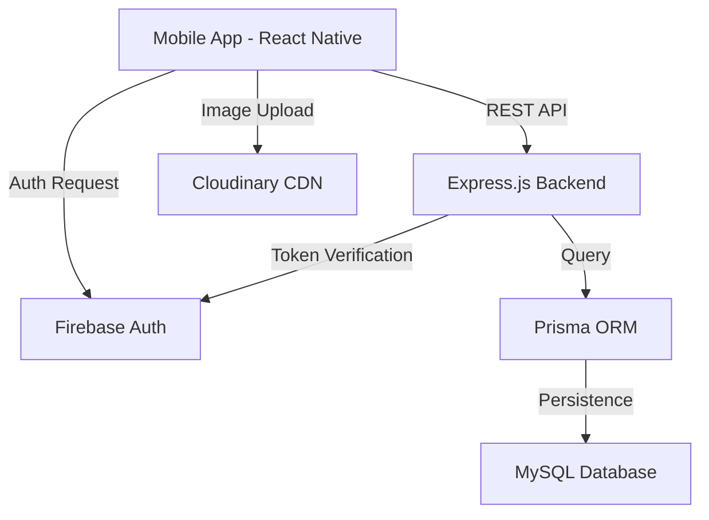

# 🏏 Wickets AI — Full-Stack Cricket Scoring & Management Platform

[-000000?style=flat-square&logo=expo)](https://expo.dev/)
[-339933?style=flat-square&logo=node.js)](https://nodejs.org/)

> A professional-grade, cross-platform mobile ecosystem for cricket enthusiasts, organizers, and professionals. Inspired by CricHeroes, Wickets AI empowers users to manage matches, tournaments, and professional profiles with real-time scoring and AI-enhanced insights.

---

## 📽️ Project Overview
Wickets AI is designed to solve the fragmentation in amateur and semi-professional cricket management. It provides a centralized platform for players to track stats, captains to find opponents, and organizers to run multi-team tournaments seamlessly.

---

## 🚀 Key Features

### 1. **Robust Scoring Engine**
*   **Atomic Event Tracking**: Every ball is recorded as an atomic event, allowing for precise statistics and a complete undo/edit history.
*   **Comprehensive Scorecard**: Real-time generation of batting, bowling, and partnership stats.
*   **Advanced Formats**: Supports T20, ODI, Test, and custom overs (T10, 100-ball, etc.).

### 2. **Professional Profile Management**
*   **Role-Based Access**: Dedicated interfaces for Players, Umpires, Scorers, and Administrators.
*   **Player Stats Dashboard**: Automated calculation of Batting Average, Strike Rate, Economy, and achievements (5-wicket hauls, centuries).
*   **Verification**: Social and Phone-based verification to ensure community integrity.

### 3. **Tournament & Match Logistics**
*   **Automated Fixtures**: Intelligent scheduling for League, Knockout, and Group-stage formats.
*   **Dynamic Points Table**: Real-time NRR (Net Run Rate) and standings calculation.
*   **Discovery ("Looking For")**: A specialized social module to find available Umpires, Scorers, or Opponent Teams based on location.

### 4. **Modern UI/UX**
*   **Design System**: Custom-built premium design system with dark mode support, glassmorphism elements, and smooth micro-animations.
*   **Hybrid Map Integration**: Search for grounds and matches using location-based filtering.

---

## 🛠️ Technology Stack

### **Frontend (Mobile)**
*   **Framework**: React Native with Expo SDK 54.
*   **State Management**: **Zustand** for lightweight, high-performance global state.
*   **Navigation**: React Navigation (Stack and Tab-based).
*   **Styling**: Custom Theme System (Vanilla CSS-in-JS) for maximum performance and design control.
*   **Utilities**: Expo Location, Image Manipulator, SVG rendering.

### **Backend (API)**
*   **Runtime**: Node.js
*   **Framework**: Express.js
*   **Database**: MySQL (hosted on Render/Local)
*   **ORM**: Prisma for type-safe database queries and migrations.
*   **Authentication**: Hybrid Firebase Auth (UI) and JWT (API) for secure session management.
*   **Storage**: Cloudinary/Multer for high-performance image processing and delivery.

### **DevOps & Tools**
*   **Version Control**: Git
*   **Developer Experience**: Nodemon, Prisma Studio
*   **Deployment**: EAS (Expo Application Services) for Mobile, Render/Railway for Backend.

---

## 📐 System Architecture

---

## 📊 Database Schema (High Level)
*   **User**: Handles core identity, auth identifiers (Firebase UID), and roles.
*   **PlayerProfile**: Stores personal stats, playing styles, and career metadata.
*   **Requirement**: Powers the "Looking For" module (Matches, Players, Grounds).
*   **Match**: Tracks game state, scores, and official assignments.
*   **Tournament**: Manages league standings, fixtures, and registration.

---

## 🏁 Getting Started

### Prerequisites
*   Node.js (v18+)
*   NPM / Yarn
*   Expo Go app on your mobile device (to scan QR)
*   MySQL Database instance

### Backend Setup
1.  `cd backend`
2.  `npm install`
3.  Create `.env` file with `DATABASE_URL` and `JWT_SECRET`.
4.  `npx prisma db push`
5.  `npm start`

### Mobile Setup
1.  `cd mobile`
2.  `npm install`
3.  Configure `API_URL` in `src/config/api.js`.
4.  `npx expo start`

---

## 🔥 Professional Challenges & Learnings
*   **DLS Algorithm Implementation**: Integrating complex cricket math (Duckworth-Lewis-Stern) for rain-affected matches.
*   **Atomic State Management**: Designing the scoring engine such that any ball can be edited without corrupting cumulative statistics.
*   **Offline First Approach**: Planning for scoring in areas with poor internet connectivity, requiring local state persistence and eventual synchronization.

---

## 📈 Future Roadmap
*   **AI Highlights**: Automated text-based match summaries using LLMs.
*   **Live RTMP Streaming**: Integrating mobile camera feeds with real-time score overlays.
*   **Payment Gateway**: Razorpay/Stripe integration for tournament entry fees and ground bookings.

---

Developed with ❤️ by **Abhinav**
